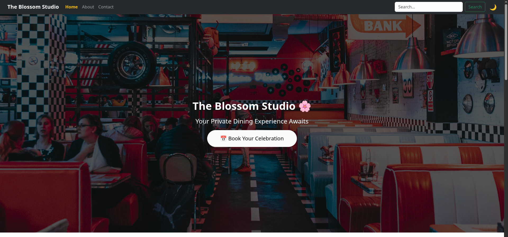
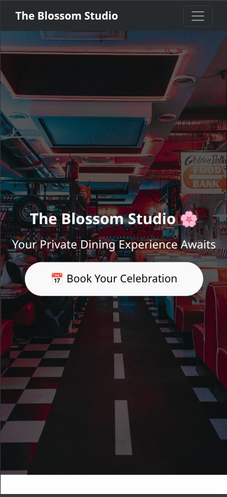

# 🌺 The Blossom Studio Restaurant Website

A modern and responsive restaurant website built using **HTML, CSS, and (if included) JavaScript** to showcase a restaurant’s offerings, menu, contact info, and more.

This project is designed to function as a complete landing page for a restaurant — with sections like About, Menu, Services, Contact, and other typical restaurant site features.

---

## 🍽️ Features

- Fully responsive layout for desktop and mobile
- Hero / banner section to introduce the restaurant
- Menu display with visual food items
- About section describing the restaurant
- Contact section for customer inquiries
- Navigation bar for smooth scrolling and site structure
- Built using semantic **HTML5 and modern CSS3**

---

## 🧱 Project Structure

```
The-Blossom-Studio/
├── index.html           # Main website file
├── public               # Public files like Logo
├── src                  # Source folder
   ├── assets            # Images , Videos , texts
   ├── components        # Components like navbar , footer etc
   ├── pages             # Pages like Home, About , etc
   ├── App.css           # File
   ├──App.jsx
   ├──index.css
   ├── main.jsx
└── README.md            # This file
```


---

## 🚀 Getting Started

### 1️⃣ Clone the Repository

```bash
git clone https://github.com/pranjalvidyarthi/The-Blossom-Studio.git
```

### 2️⃣ Open the Website

Open the terminal and type `npm run dev` then file will be opens in  your web browser locally:

```
npm run dev
```
Live Previw link : https://pranjalvidyarthi.github.io/The-Blossom-Studio/
---

## Preview :
</img>
</img>

## 🎨 Technologies Used

- **HTML5** — Structure and layout  
- **CSS3** — Styling, layout, responsiveness  
- **JavaScript** *(optional)* — Interactivity (only if your repo includes any JS files)

The website features sections such as:

- Navigation bar
- Hero banner with call to action
- About the restaurant
- Menu showcasing food items
- Contact and footer

This structure follows standard restaurant site layouts commonly seen online. :contentReference[oaicite:0]{index=0}

---

## 📝 How It Works

1. **Navigation Bar:** Links to different sections like Home, Menu, About, Contact  
2. **Hero Section:** Introduces the restaurant with imagery and a tagline  
3. **Menu Section:** Displays food items with descriptions and prices  
4. **Contact Section:** Shows contact form or details for reservations or feedback

These are common elements used to build engaging restaurant websites. :contentReference[oaicite:1]{index=1}

---

## ✨ Customization

You can customize the website by:

- Changing images in the `assets/` folder
- Updating menu items and restaurant info
- Modifying colors, fonts, and layout in `style.css`
- Adding animations or interactions if desired

---

## 🤝 Contributing

Contributions are welcome! To contribute:


## 👨‍💻 Author

**Pranjal Vidyarthi**  
If you found this project useful, ⭐ star the repository!

Happy coding !!
